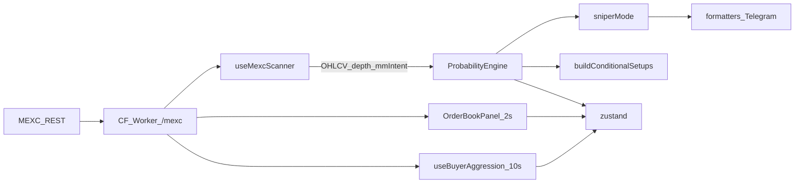

# Audit: Market Analysis — Enterprise System

**Date:** 2026-07-23  
**Scope:** Mini App engine + hooks + MEXC API + CF Worker proxy/scanner

## Verdict

Analysis is **REST-polled** (OHLCV, depth, deals, ticker) through Cloudflare Worker `/mexc`. Core signal path is **ProbabilityEngine + SMC confluence**. There is **no WebSocket** for order book or trades. Spoof/iceberg detectors exist as libraries but are **not wired** into live OB/PE. CVD is an **OHLCV proxy**, not true tape delta.

---

## 1. Order Book Analysis

| | |
|--|--|
| **Status** | Partially implemented (REST metrics + walls + OBI; no WS; spoof/iceberg unwired) |
| **Paths** | `src/engine/orderbook/` · `src/engine/mm/obi.ts` · `src/hooks/useOrderBookHistory.ts` · `src/components/tactical/OrderBookPanel.tsx` · `src/api/mexc/index.ts` (`fetchDepth`) |
| **Transport** | REST only — `GET /api/v1/contract/depth/{symbol}` via worker |
| **Update** | UI panel **2s**; scanner per-symbol each cycle (~75s loop) |

**Metrics:** imbalance (−100…+100), bid/ask vol, walls (>3× median), spread, pressure; weighted OBI (0.1%/0.5%/1%); heatmap / heatmap3d; whale walls; wall lifetime tracker.

**Delta / spoof / iceberg:** Wall history + density prodding in panel. `mm/spoofing.ts` + `mm/iceberg.ts` exported but **never called** from hooks/PE/OrderBookPanel. No true L2 delta stream.

```ts
// src/engine/orderbook/analyzer.ts (concept)
const imbalance = totalVolume > 0
  ? ((bidVolume - askVolume) / totalVolume) * 100 : 0
const walls = detectWalls(bids, asks)
```

**Data source:** MEXC REST depth → proxy → client.

---

## 2. Trade Feed / Tape Reading

| | |
|--|--|
| **Status** | Partial — REST deals poll; no `src/engine/tape/`; no WS |
| **Paths** | `src/engine/aggression/` · `src/hooks/useBuyerAggression.ts` · `src/engine/orderbook/tapeMomentum.ts` (OB imbalance, not trades) · meme `absorptionAlert.ts` |
| **Transport** | REST `GET /api/v1/contract/deals/{symbol}` |
| **Update** | Aggression **10s**; meme scanner uses deals each coin pass |

**CVD:** `src/engine/orderflow/cvd.ts` — candle close≥open → +vol (proxy).  
**Absorption:** SMC VSA candle + meme `detectIcebergAbsorption` + MM effort-vs-result.

```ts
// src/engine/orderflow/cvd.ts
const delta = close >= open ? volume : -volume
cvd += delta
```

---

## 3. Volume Analysis

| | |
|--|--|
| **Status** | Partial — VPVR + CVD divergence proxy; no `src/engine/volume/` |
| **Paths** | `src/engine/volumeProfile/vpvr.ts` · `orderflow/cvd.ts` · `derivatives/liquidations.ts` (VOLUME_POCKET) · `indicators/volume.ts` · chart POC in `zones/` / `useChartZones` (simpler, separate from VPVR) |

**VPVR:** bins → POC/VAH/VAL; OB∩POC confluence in PE.  
**Clusters:** volume pockets + equal H/L as liq proxies.  
**CVD divergence:** PE boost when aligned with side.

---

## 4. Market Maker Intent

| | |
|--|--|
| **Status** | Implemented and wired (scanner + OrderBookPanel + PE + setups) |
| **Paths** | `src/engine/mm/` — `mmIntent.ts`, `obi.ts`, `priceProdding.ts`, `effortVsResult.ts`, `spoofing.ts`, `iceberg.ts`, `tripleFilter.ts`, `btcDump.ts`, `breakeven.ts` |

**Patterns used live:** book pressure, weighted OBI, price prodding, BSL/SSL hunt (micro→macro stop-hunt), preferred side + score boosts.  
**Library-only:** spoof disappear, iceberg refill (not passed into `computeMmIntent` from panel/scanner).  
**Effort vs result:** module exists; TradeCopilot uses effort/OBI/BTC dump for open trades.

```ts
// useMexcScanner → PE
const depth = await fetchDepth(symbol, 20)
const obMetrics = calculateOrderBookMetrics(depth)
mmIntent = computeMmIntent({ price, book: obMetrics, weightedObi: wobi, liquidityMap })
analyzeSymbol({ …, bookImbalance, mmIntent, … })
```

**Data:** REST depth snapshots (not continuous L2).

---

## 5. Surgical Entry

| | |
|--|--|
| **Status** | Implemented |
| **Paths** | `src/engine/surgical/surgicalEntry.ts` · PE · `sniperMode.ts` · store `surgicalEntries` |

**States:** `WAITING_SWEEP` → `WAITING_CONFIRM` → `READY` | `INVALIDATED` | `MISSED` (+ `IDLE`).  
**READY:** `status === 'READY' && limitEntry > 0`.  
**Live OB:** uses MM hunt targets / LTF structure from candles + mmIntent, not tick-by-tick book stream.

```ts
export function isSurgicalReady(s): boolean {
  return s?.status === 'READY' && s.limitEntry != null && s.limitEntry > 0
}
```

---

## 6. Data Sources & WebSockets

| | |
|--|--|
| **Status** | REST-only; **no WebSocket** in app or worker |
| **Client** | `src/api/mexc/index.ts` → `${VITE_MEXC_PROXY_URL}/mexc/...` |
| **Worker** | `workers/mexc-proxy` — CORS proxy + cron scanner + Telegram/KV |

| Method | Endpoint |
|--------|----------|
| `fetchOhlcv` | `/api/v1/contract/kline/{symbol}` |
| `fetchDepth` | `/api/v1/contract/depth/{symbol}` |
| `fetchTickers` / `fetchTicker` | `/api/v1/contract/ticker` |
| `fetchFundingRate` | `/api/v1/contract/funding_rate/{symbol}` |
| `fetchRecentTrades` | `/api/v1/contract/deals/{symbol}` |
| `getTopVolumeCoins` | ticker sort — **unused** |

Worker cron (~`*/2`): ticker, detail, funding, kline — no depth/deals WS.

---

## 7. ProbabilityEngine

| | |
|--|--|
| **Status** | Core orchestrator — implemented |
| **Path** | `src/engine/ProbabilityEngine.ts` |

**Wired imports:** `smc`, `orderbook/scoreBooster`, `strategies`, `volumeProfile`, `derivatives`, `orderflow`, `confidence/invalidation`, `trend/htfTrendStrength`, `prediction/ghostPath`, `zones/globalFibonacci`, `sessions/sessionFlip`, `mm/mmIntent`, `surgical/surgicalEntry`.

**Inputs:** multi-TF OHLCV, daily bias, BTC, optional wallTracker, news boost, liquidityMap, bookImbalance, mmIntent, sessionDna, previousSurgical.

**Confidence:** style classify → scalp/intraday confidence (structure, OF, CVD, liq cluster, OB, killzone, MM gates). Soft vs hard confluence thresholds `3.5` / `4.5`. Cooldown 90m / scalp 25m.

**OB / MM / surgical:** imbalance + wall boost; mmIntent score ±2 + zones; surgical READY gates setup when micro hunt present; limit overrides SL/TP when READY.

*(Full file ~1.5k lines — not dumped; wiring above is the integration map.)*

---

## 8. Setup Recognition

| | |
|--|--|
| **Status** | Implemented |
| **Paths** | `src/engine/setups/buildConditionalSetups.ts`, `evaluateSetupReadiness.ts`, `types.ts` · prediction via `usePriceForecast` |

**Kinds:** `FORECAST_A/B/C`, `MM_HUNT`, `SURGICAL`, `BOUNCE_SSL`, `BOUNCE_BSL`, `STOP_THEN_REVERSE`.  
**Status machine:** HYPOTHESIS → ARMED → READY / INVALIDATED (preconditions + live candle re-check).  
**Probability:** from forecast scenarios + MM/surgical confidence — not a separate confluence scorer beyond PE/SMC.

---

## 9. Pattern Detection (SMC)

| | |
|--|--|
| **Status** | Implemented in `src/engine/smc/` (no `src/engine/patterns/`) |

| Pattern | Notes |
|---------|--------|
| BOS / structure | `detectMarketStructure` |
| MSS | `detectMSS` (5m/1m) |
| FVG | `findFvg` |
| Order blocks | `findOrderBlocks` |
| Liquidity sweep/raid | `detectLiquidityRaid` |
| Absorption (VSA) | `detectAbsorptionCandle` |
| LTF CHoCH | `detectLTFChoCH` |
| OTE | `calculateOTEZone` |
| Equal H/L map | `buildLiquidityMap` |
| PO3 | `analyzePO3` |
| Confluence | OB+3, FVG+2, OTE+3 → score 0–10 |

---

## 10. Advanced Analytics

| Topic | Status | Path |
|-------|--------|------|
| Funding | Partial — ticker + meme squeeze + `perpetualGuard`; not PE core | `api/mexc`, meme |
| Open Interest | Partial — `holdVol` on ticker; meme fuelCache | ticker / meme |
| Liquidations | Proxy only (equal H/L + volume pockets) | `derivatives/liquidations.ts` |
| Sessions | Yes — DNA, map, calculator, newsCalendar, **sessionFlip in PE** | `sessions/` |
| Regime | No dedicated module | — |
| HTF trend | Yes | `trend/htfTrendStrength.ts` |

---

## Catalog: `src/hooks/`

| Hook | Purpose |
|------|---------|
| `useMexcScanner` | Watchlist → PE (~75s), tickers 5s |
| `useMemePulseScanner` | Meme round-robin ~22s |
| `loadMemeCoinAnalysis` | One-shot meme helper |
| `useBuyerAggression` | REST deals → aggression 10s |
| `useOrderBookHistory` | OB imbalance series (charts/ML) |
| `useMLPredictor` | Client ML on OB features |
| `useTradeCopilot` | Active trade MM/invalidation 5s |
| `usePriceForecast` | Scenario / macro forecast |
| `useMultiTFAnalysis` | Multi-TF + prediction liquidity 5m |
| `useChartIndicators` | EMA/SMA/BB/RSI/MACD/VWAP/ATR |
| `useChartZones` | OB/FVG/POC/VA/fib overlays |
| `useSessionData` | Session/weekend/news on chart |
| `useNewsIntelligence` | News sentiment 5m |
| `useFearGreed` | F&G 15m |
| `useTelegramWebApp` | TG Mini App shell |
| `useTelegramAlerts` | Push sniper/meme to bot |
| `useSignalJournalResolver` | App journal resolve 45s |
| `useBotJournalSync` | Bot cron journal → Lab 120s |

## Catalog: `src/engine/` modules

```
aggression, composite, confidence, derivatives, indicators, journal,
meme, ml, mm, orderbook, orderflow, prediction, sentiment, sessions,
setups, smc, strategies, surgical, telegram, trend, volumeProfile, zones
+ root: ProbabilityEngine.ts, sniperMode.ts, RSICalculator.ts, types.ts
```

---

## Data flow



---

## Integration points

### 1. Order book → ProbabilityEngine

```
API fetchDepth
  → useMexcScanner / OrderBookPanel
  → calculateOrderBookMetrics (+ OBI / wallTracker in UI)
  → store.setOrderBookMetrics / setMmIntent
  → analyzeSymbol({ bookImbalance, mmIntent, wallTracker? })
  → scoreBooster / mm score nudge / surgical hunt
```

### 2. MM Intent → signals

- Stored on `CoinSignal.mmIntent` + store `mmIntent[symbol]`.
- PE soft-score boosts for aligned side; zone tags `MM_INTENT:…`.
- Setups: `MM_HUNT`, `STOP_THEN_REVERSE` from hunt legs.
- Soft/inactive: micro hunt without surgical READY → setup not fully active (`setupActive = hasMicroHunt ? preciseReady : true`).

### 3. Surgical → Sniper READY gate

```ts
// sniperMode.ts
if (surgical && surgical.status !== 'IDLE') {
  if (!isSurgicalReady(surgical)) return false
}
```

### 4. Telegram alert fields

`src/api/telegram/formatters.ts`:
- **Sniper:** contract, side, entry, SL, TP, win%, R:R, reasons, risk/reward %.
- **Meme:** pullback zone (signal price, zone low/high, limit, invalidate).
- Payload kinds: `SNIPER | MEME | SETUP_WATCH | SYSTEM` (alerts API).

### 5. Signal Journal entry

`src/engine/journal/types.ts` — `SignalJournalEntry`:

`id, symbol, direction, source (MEME/SMC/SNIPER/MANUAL), setupType, confidenceAtSignal, entry/sl/tp, status, pnl/R, mfe/mae, mmStatus, factors, resolveSource, …`

Bot journal (worker KV) is separate — Lab tab «Бот» via `GET /telegram/journal`.

---

## Performance

| Loop | Interval |
|------|----------|
| Scanner cycle pause | 75s |
| Ticker poll | 5s |
| Order book UI | 2s |
| Buyer aggression | 10s |
| Meme scanner | 22s |
| Trade copilot | 5s |
| MultiTF / news | 5m |
| Fear & Greed | 15m |
| Journal resolve | 45s |
| Bot journal sync | 120s |
| PE cooldown | 90m / scalp 25m |

**Caching:** news ~5m; meme `fuelCache` in-memory; bot journal localStorage mirror; BTC candles copilot ~60s.  
**Web Workers:** none for analysis. CF Worker = proxy + cron only.

---

## Gaps

### 9–10. TODO / stubs

- `ProGate.tsx`: `TODO: Implement actual Telegram Stars payment`
- `types.ts`: `@deprecated` SystemCore / IndicatorBucket
- `ml/trainData.ts`: synthetic training patterns (not live)
- No engine `FIXME` / `MOCK` / `DISABLED` feature flags

### 11. Engine modules NOT imported by PE

`aggression`, `composite`, most of `confidence` (except invalidation), `indicators`, `journal`, `meme`, `ml`, most of `orderbook` (except scoreBooster), `sentiment`, `setups`, `telegram`, most of `prediction` (except ghostPath), most of `mm` (except mmIntent), most of `sessions` (except sessionFlip), most of `zones` (except globalFibonacci), `RSICalculator`, `sniperMode` (downstream).

### 12. API defined but unused / thin

| Export | Use |
|--------|-----|
| `getTopVolumeCoins` | **Unused** |
| `fetchFundingRate` | Only `perpetualGuard` |
| `fetchTicker` | Mostly guard; scanners use `fetchTickers` |
| depth / deals / kline / tickers | Heavily used |

---

## Special attention matrix

| Capability | Exists? | Used live? | Notes |
|------------|---------|------------|--------|
| WS orderbook stream | No | — | REST poll 2s |
| WS trade feed | No | — | REST deals 10s |
| Delta tracking (generic) | Partial | Yes (walls/heatmap/prodding) | Snapshot diffs, not WS delta |
| Real-time spoof detection | Code yes | **No** | `mm/spoofing.ts` unwired |
| Iceberg detection (MM) | Code yes | **No** | `mm/iceberg.ts` unwired |
| Iceberg absorption (meme) | Yes | Yes | `meme/absorptionAlert.ts` |
| Tape reading patterns | Partial | Aggression + meme | `tapeMomentum` = OB label only |
| Advanced CVD (true tape) | No | Proxy only | `orderflow/cvd.ts` |
| Liquidity vacuum / gap | Yes (meme) | Yes | `meme/liquidityGap.ts` |
| Limit order clustering | Partial | Walls / density / prodding | No dedicated cluster engine |

---

## Duplication / dead-ish code

1. Two `buildLiquidityMap` shapes: `smc` vs `prediction/liquidityMap`.
2. `tapeMomentum` name ≠ trade tape.
3. `orderbook/detector.ts` — re-export stub.
4. Spoof / iceberg MM — library only.
5. Chart POC vs VPVR POC.
6. `RSICalculator.ts` vs `smc.calculateRsi` / indicators.
7. Deprecated SystemCore types.

---

## Suggested next upgrades (informational)

1. Wire `spoofing` + `iceberg` into OrderBookPanel wall tracker → pass alerts into `computeMmIntent`.
2. MEXC WS depth/deals (or worker fan-out) for true delta + CVD.
3. Replace OHLCV CVD proxy when trade stream exists.
4. Drop or use `getTopVolumeCoins`; unify liquidity map types.

---

*Companion product map: [`APP_AND_BOT.md`](APP_AND_BOT.md).*
